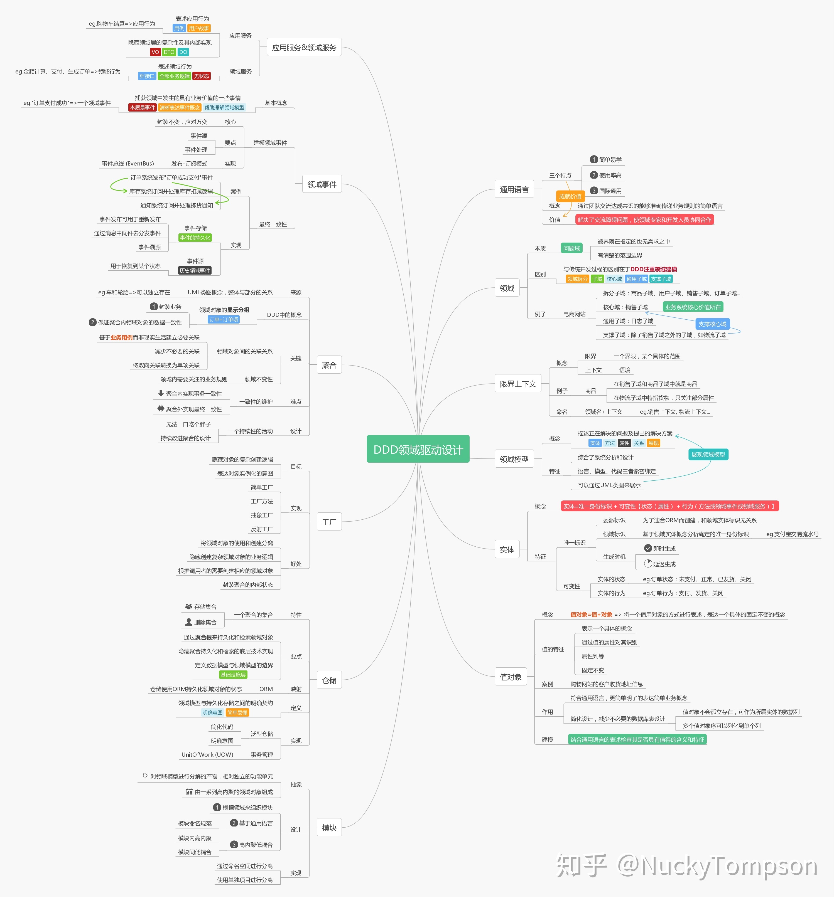
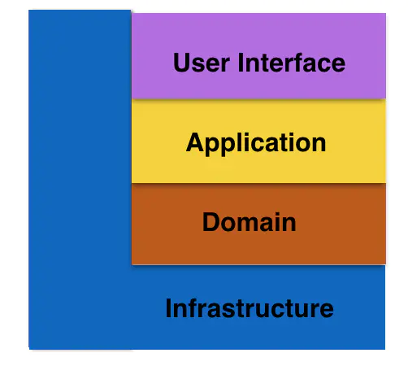
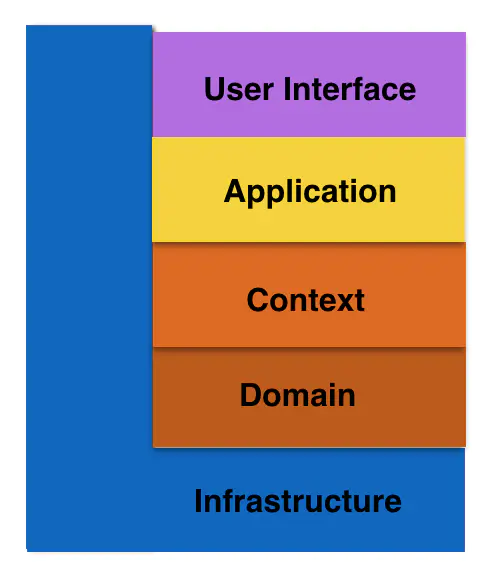
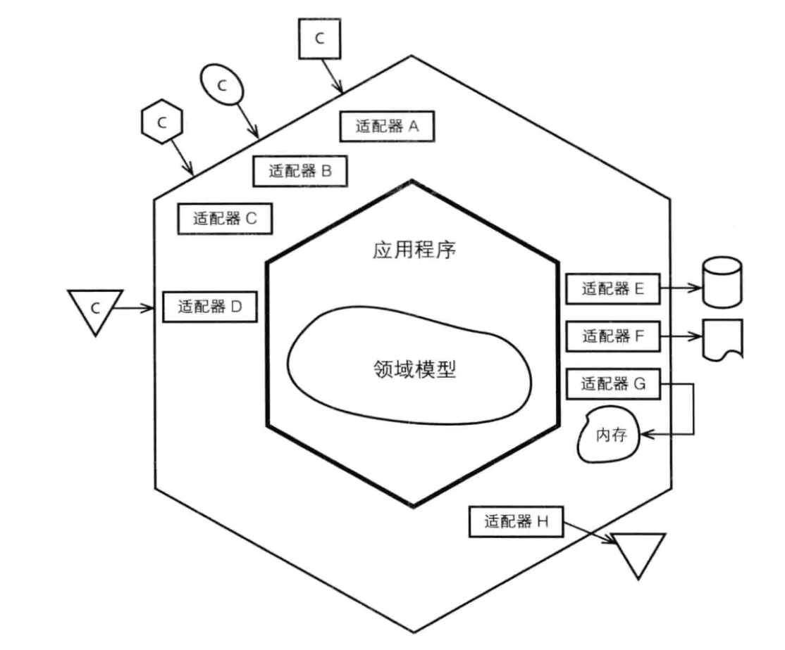

- # 前言
  collapsed:: true
	- 如果你技艺超群，无招胜有招，无需在乎所谓分层，无所谓隔离...
	- 优秀的理念如何平民化，人人用的上，人人用的对
	- 可以通过约定，也可以流程，也可以通过工具来规范DDD的逻辑
		- 工具  优于  流程  优于 约定
	- DDD的作用是简化，而不是复杂化
		- 如何界定什么是复杂，什么是简单
			- 多就是复杂？
				- 多而不杂，每个工程的结构都类似，即便有百八十个工程，也是讲的清楚的
			- 少就是简单？
				- 所有代码都写在一个工程里，工程数量少了，里面的代码却是很难讲清楚
		- 简单的规则，构造复杂的系统
- # 当前软件开发面临的问题
  collapsed:: true
	- 微服务膨胀
	- 对老系统，只敢打补丁，不敢做修改
	- 技术实现无法应对快速变化的业务
- # 什么是复杂，什么是简单
  collapsed:: true
	- 多不代表复杂，少不见得简单
	- 我随心所欲的简单，就是别人抓耳挠腮的复杂。代码首先是写给人看的，更多时候是写给别人看的。
	- 规则复杂？规则简单？
	  collapsed:: true
		- 规则复杂时规则条目多
		- 规则与规则的适用关系多
	- 结构简单？结构复杂？
		- 结构种类多
		- 结构与结构的组合多
	- 不同的业务域对于复杂的定义是不一样的。与其定义什么是复杂，**不如定义什么是重要**。
- # DDD知识点
  collapsed:: true
	- 
- # 程序设计原则
  collapsed:: true
	- 面向接口编程
	- 高内聚，低耦合
	- 开闭原则
	- 单一原则
	- 代替原则
	- 依赖原则
	- 接口隔离原则
	- 最少原则
	- 最小依赖原则
		- 只依赖定义，不依赖实现
		- 直接最小化依赖，由于间接扩大化依赖
	- 合成/聚合复用原则
	- [参考](https://www.jianshu.com/p/6b5e4c9872fe)
- # 为什么要用DDD
  collapsed:: true
	- 发挥业务专家的优势（业务内核）
		- 业务专家不关注底层实现，不关注如何对外暴露能力，只关注业务逻辑
			- 业务逻辑的本质是
				- 模型
				- 能力的定义
				- 对能力的编排
			- 业务逻辑的调整，不影响业务的暴露和基础设施的使用
			- 基础设施的特性不入侵业务流程
				- @Transaction是否可以出现在领域层的代码
	- 能快速替换基础设置
		- 例如：从aws迁移到阿里云，scheduler更换，消息中间件更换
	- 能快速以新的服务暴露方式对外提供服务（成为其他系统的基础设施）
		- 例如：dubbo换http
	- 能快速以新的方式集成其他服务的调用
		- 例如： http 调用 换成 dubbo 调用
	- rpc接口变更，请求参数，返回结果等模型变更是否影响领域模型
		- 原则上不该影响，在rpc调用的具体实现的模块做领域模型和rpc模型的转换
	- 支持多云混合部署
		- 不同云服务的同种类型的中间件不完全相同，即基础设施未必完全相同
	- 问题：为什么要替换基础设施，为什么要更换rpc？
		- 杠精
- # DDD中的概念
	- 领域（Domain）
	- 领域服务（DomainService）
	- 领域对象
		- 贫血领域对象 Anemic Domain Object
		- 充血模型
			- 例如：自身参数的关联性校验
		-
- # DDD多层架构
	- ## 四层架构
		- UI层 （User Interface）
			- 前后端分离
				- Web
				- H5
				- 涉及技术： react、vue、静态页面托管、cdn
			- 原生App
				- Android
				- IOS
			- 小程序
				- 微信小程序
				- 支付宝小程序
				- 抖音小程序.
		- 应用层
			- 服务能力的暴露
			  collapsed:: true
				- http
				- dubbo
				- WebService
				- mq consumer
				- task executor
				- ...
			- 应用容器
			  collapsed:: true
				- Tomcat
				- Netty
				- JBoss
				- ...
		- 领域层
			- 核心域 Core Domain
				- 核心业务模型
				- 核心能力定义
				- 核心能力编排
			- 支撑域 Support Domain
				- 对其他系统能力的定义
				- 对基础架构能力的定义
				- ...
		- 基础架构层
		  collapsed:: true
			- 数据库
				- MySQL
				- Oracle
			- 消息中间件
				- RabbitMQ
				- RocketMQ
				- ...
			- 远程调用
			  collapsed:: true
				- http
				- dubbo
				- ...
		- 
	- ## 五层架构
		- 
	- ## 六边形架构
		- [[依赖倒置]]
		- 
	-
- # 一个符合DDD理念的Spring Maven工程结构？
	- maven工程结构
		- 目录结构
		- module依赖结构
		- jar包依赖结构
		- implement结构
		- 代码调用结构
	- module依赖的目的有三种
		- 为了实现 implement
			- 分离interface和impl是为了面向接口编程，对同一个接口可以有不同的实现
		- 为了调用 call
			- jar包依赖一般情况下是为了调用，少数情况是为了实现
			- 分层是为了规范代码调用，避免出现循环依赖，避免出现职能混乱，避免不必要的技术约定的入侵（例如token，cookie等参数不允许入侵biz-service）
			- 为了避免底层代码调用上层代码
		- 为了打包
			- War
			- Jar
	- 屏蔽具体实现的方案（[[依赖倒置]]）
		- 所谓屏蔽实现，即只依赖接口，通过编排接口完成业务流程，不关心接口内部的具体实现。
		- 依赖倒置，是指底层实现上层的接口，底层不可以跨越访问屏障，底层不可以获得调用上层接口权限。
		- {:height 355, :width 747}
	- DDD +Spring Mavne工程
		- 
	- 各module的用途
		- biz-interface
			- 领域实际上是对能力的定义和抽象，对应到设计图，就是对用例图的代码级定义
		- biz-impl
			- 对应到设计文档，是对业务流程图的实现，是对领域层定义的能力编排
		- dubbo-impl、http-impl、mq-consumer-impl，job-scheduler-impl
			- 能力暴露，是技术实现层面的实现，是流量入口
		- repository
			- repository-interface是对Entity的持久化能力定义
			- repository-impl是对持久能力的实现
			  collapsed:: true
				- RDBMS
					- MySQL
					- Oracle
				- NoSQL
					- RDS
					- PolarDB
				- NewSQL
					- TiDB
		- rpc
			- 是对对应到设计文档时序图中的二方系统生命线
			- rpc-interface是对二方服务的能力定义
			- rpc-impl是对二方服务的具体使用方式的实现
				- http FeignClient
				- Dubbo
				- WebService
		- publisher
			- 对领域层事件进行发送的抽象能力定义
			- publisher-impl是对事件发送能力的具体实现
				- rocketmq
				- rabbitmq
				- kafka
				- ...
	- 
- # DDD的落地成本
	- 对开发人员的要求很高
	- 对业务的抽象能力强
	- DDD用的差，比用MVC更差
- # 讨论
	- DDD 多层架构、工程目录结构、模块依赖结构是不是一回事儿？maven工程的module必须跟DDD分层一一对应吗？
	- 是不是为了DDD就可抛弃原有的程序设计原则？是否在不抛弃原有设计原则的基础上，做到DDD分层？
	- 为了实现DDD的设计目标，工程结构应该做何种设计，避免出现代码不规范导致的基础设施难以替换？
- # 废话
	- 考虑全面，多方取舍，方能既要且要还要。
	- 事实描述清楚，即方案的优劣描述清楚。
	- 陈述自己的观点，不做决定
	- 决策是站在不同的立场下做的选择
- # 扩展
	- [[康威定律]]
	-
- # 参考资料
	- [领域驱动设计DDD](https://www.cnblogs.com/Leo_wl/p/3866629.html)
	- [领域驱动设计-DDD基础思想](https://zhuanlan.zhihu.com/p/109114670)
	- [领域驱动设计-wiki](https://zh.wikipedia.org/wiki/%E9%A0%98%E5%9F%9F%E9%A9%85%E5%8B%95%E8%A8%AD%E8%A8%88)
	- [DDD模式-从天书到实战](https://zhuanlan.zhihu.com/p/91525839)
	- [利用Spring Cloud实现微服务（二）--领域驱动设计](https://www.jianshu.com/p/f7c1d9fde7a8)